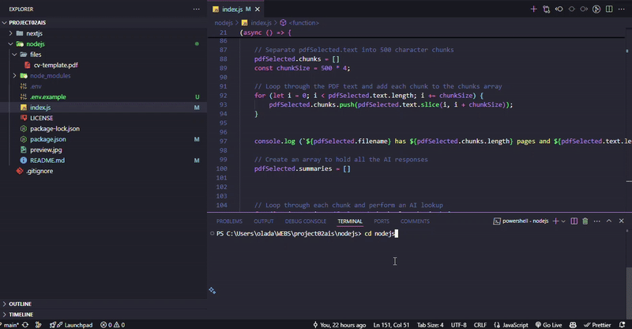

# PDF Summarizer - Node.js

This is a Node.js application that allows users to upload PDF files and summarize the content of the PDF file. The application uses Groq to run the large language model (LLM) inferences that power the PDF summarization. It demonstrates the ability to easily use LLMs to implement intelligent natural language workflows.

## Preview



## Instructions

This simple script will convert PDF files into summarized TXT files using Groq-sdk
## Getting Started

1. Run `npm install` to install modules.
2. Place `.pdf` files in the `files` folder.
3. Create a `.env` file in the root directory.
4. Sign up at [Groq](https://groq.com/) and generate an API key.
5. Add your Groq API key to the `.env` file:
   ```
   GROQ_API_KEY=your_api_key_here
   ```
6. Run `npm start` in the terminal.

## Usage

After starting the application:
1. Select a model from the available Groq models
2. Choose a PDF file from the `files` folder
3. The application will process the PDF and create a summary
4. Find the summary in a .txt file with the same name as your PDF in the `files` folder

## Features

- Interactive model selection from available Groq models  
- Support for multiple PDF files
- Automatic chunking of large documents
- Summary of summaries for very large documents
- Output as txt 

## Dependencies

- [Groq SDK](https://www.npmjs.com/package/groq-sdk) - Groq API client for Node.js
- [pdf-parse](https://www.npmjs.com/package/pdf-parse) - Pure JavaScript cross-platform module to extract texts from PDFs
- [prompts](https://www.npmjs.com/package/prompts) - Interactive command line interface
- [dotenv](https://www.npmjs.com/package/dotenv) - Environment variable management
- [yargs](https://www.npmjs.com/package/yargs) - Command line argument parsing

## License

This project is licensed under the MIT License.
